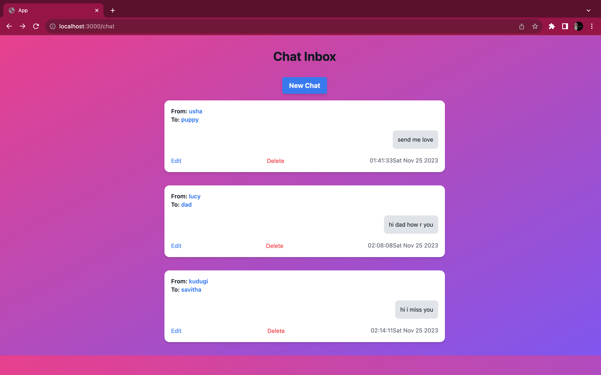
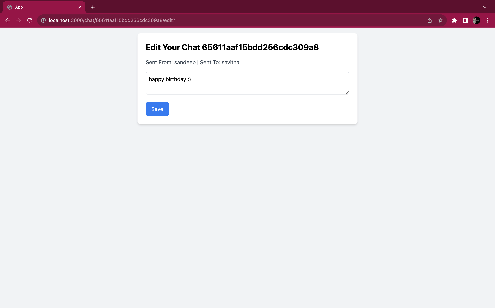
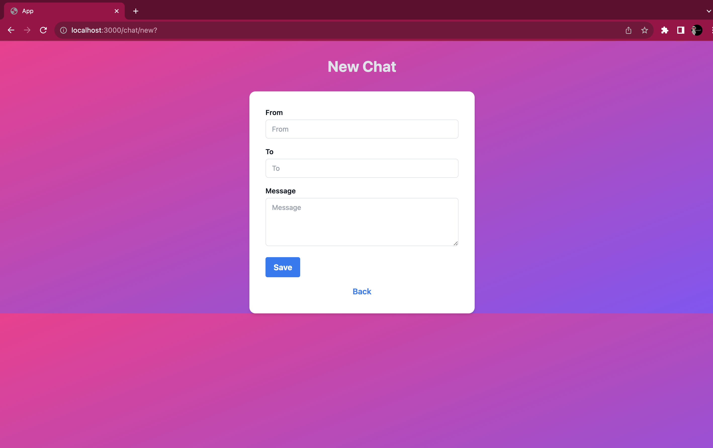

# MongoDB with Express CRUD Operations - Simple Chat App

## Description
This repository contains a basic chat application built using MongoDB for data storage and Express for handling CRUD operations. The app allows users to send and manage chat messages between different users.

## Dependencies
- **ejs**: "^3.1.9"
- **express**: "^4.18.2"
- **method-override**: "^3.0.0"
- **mongoose**: "^8.0.1"
- **nodemon**: "^3.0.1"
- **uuid**: "^9.0.1"


## Install Dependencies
```bash
npm install

```
## Access Application

brew services start mongodb-community
nodemon index.js
Open your browser and visit [http://localhost:3000](http://localhost:3000).

## Usage
The application supports the following routes:

### Routes:
- **GET** `/chat`: Displays all chat messages.
- **GET** `/chat/new`: Renders the form to create a new chat message.
- **POST** `/chat`: Creates a new chat message.
- **GET** `/chat/:id/edit`: Renders the form to edit a specific chat message.
- **PUT** `/chat/:id`: Updates a specific chat message.
- **DELETE** `/chat/:id`: Deletes a specific chat message.

## Structure
The project structure is organized as follows:
- `models/chat.js`: Defines the Mongoose schema for chat messages.
- `public/`: Contains static assets.
- `views/`: Contains EJS templates for rendering views.
- `app.js`: Main entry point for the Express application.
- `init.js`: data entry to db.
## Screenshots



